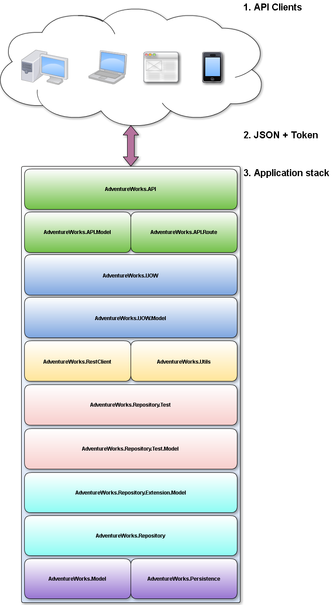
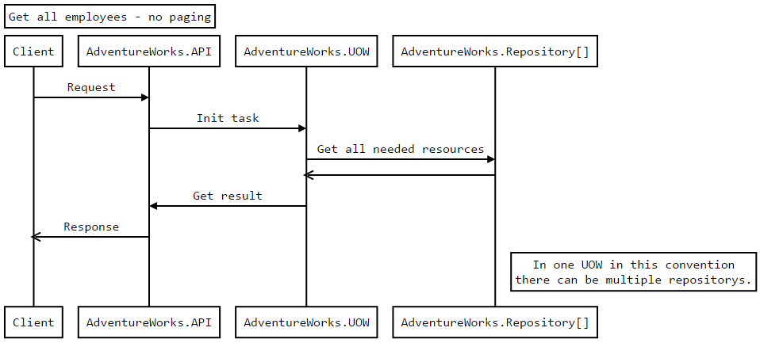

# **AdventureWorksAPI**

A **.Net REST** application to distribute data for multiple clients.  It' s meets the following guidelines:

 - use as much as possible of reflections and generic types for better code reusage -  **main goal!**
 - use Nancy
 - NHibernate
 - Token based authentication
 - REST, JSON

<i class="icon-list"> Goals
------------------------------
**Must have**

 1. Fulfill all guidelines

 2. Average performance

 3. N-tier architecture

 4. Implement: generic repository, UOW (in the context of one type of operafion)

 5. Follow SOLID principles

**Nice to have**

 1. REST Client for all .Net clients

 2. Repository tests

 3. Categorized code

<i class="icon-book"> Planning
------------------------------
The planning includes several steps of research. the main

 - **Databse** - the *AdventureWorks* database was selected. The copy of the database is located in the .\Utils\DB\AdventureWorks2008_bak.rar

 - **Project draft** - the project should implement the following components

1. **API Clients** -
    all the clients that can provide the correct credentials.
2. **JSON + Token** -
    the communication will be done by using the JSON data type with the received Token for authentication.
3. **Application stack** - the application will contain different layers as shown above.
  - **AdventureWorks.API** - module responsible for IO as well as authentication.
    Login and password are the same, but the password needs to be MD5 on the client side before sent. - improve security.
  - **AdventureWorks.API.Model** - returning data model by ***AdventureWorks.API***.
  - **AdventureWorks.API.Route** - routes for *NancyModules*.
  - **AdventureWorks.UOW** - project build for executing data operations. Each operation will have it's own UOW. The idea of the project is based on the original design patter as well as the codeproject idea (http://www.codeproject.com/Articles/770156/Understanding-Repository-and-Unit-of-Work-Pattern).
  - **AdventureWorks.UOW.Model** - data model for ***AdventureWorks.UOW***.
  - **AdventureWorks.RestClient** - universal *API* client for all the *.Net* application.
  - **AdventureWorks.Utils** - all additional tools vital for the project but not as big for it's own category.
  - **AdventureWorks.Repository.Test** - test project that will follow this schematics:

    1. Before all tests load test database.
    2. Read the < T > test data file. - based on the type. The data is stored in the AdventureWorks.Repository.Test.Model\TestData folder. All files follow the same convention NameOfDBModel.xml.
    3. If the data isn't loaded throw InvalidOperationException.
    4. else run test in the following order: Insert, GetById, SearchFor, GetAll, Delete
    5. The final step is to load test database.
  - **AdventureWorks.Repository.Test.Model** - models for ***AdventureWorks.Repository.Test***. The models represent a simplified version of the business ***AdventureWorks.Model***, because of the data serialization/deserializtion of the test data. The test data should comply with the repositories requirements.
  - **AdventureWorks.Repository.Extension.Model** - for more complex repository tasks.
  - **AdventureWorks.Repository** - each table has it's own repository. All the repositories share the same basic functionality.
  - **AdventureWorks.Model** - DB data model (Table).
  - **AdventureWorks.Persistence** - mapping and session management.

<i class="icon-sitemap"> Additional projects
------------------------------
1. **PasswordRestarter** - restarts all passwords in the database to this format
>MD5(emailAddress + MD5(emailAddress) + PasswordSalt) + "="

  *API* every user has the the password the same as the login. Important to note that before we try to authenticate we should MD5 the password.

2. **TestDataFromDBToXML** - retrieves the data from the DB and converts them to ***AdventureWorks.Repository.Test.Model***.

<i class="icon-sitemap"> Implementation
------------------------------
The business logic will be implemented always in the same way. First the server - *AdventureWorks.API* - handles the call and decides if the caller is authorized. Then the correct *NancyModule*, *method* calls the *UOW* with the business logic.  

The main goal is to fully utilize the generic functionality of the technology. Furthermore using *DI* frameworks should be more robust and easier to maintain.

<i class="icon-sitemap"> Setup
------------------------------
1. Load the database
2. Change the connection strings
3. Restart the passwords - ***PasswordRestarter***
4. Reinstall all packages in the main project
> Update-Package -reinstall
5. Run project - ***AdventureWorks.API***

<i class="icon-sitemap"> TODO
------------------------------
- Implement the UOW layer
- Test for API (SoapUI)
